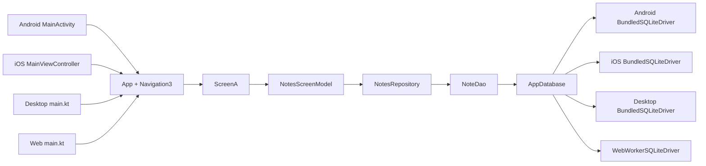

# RoomAndNavigation3


This project is a Kotlin Multiplatform app that shows:

- Navigation with `Navigation3`
- Room 3 database for shared CRUD
- Android, iOS, Desktop, JS, and Wasm web support
- Live UI updates using `Flow`

The app is a simple notes app:

- `Screen A` shows a form and a notes list
- `Screen B` is a second screen to prove navigation works
- You can add, edit, and delete notes
- The list updates live
- Notes are stored in a local database

## Platforms

This project currently supports these Room paths:

- Android: Room 3 + `BundledSQLiteDriver`
- iOS: Room 3 + `BundledSQLiteDriver`
- Desktop/JVM: Room 3 + `BundledSQLiteDriver`
- Web JS: Room 3 + `sqlite-web` + worker
- Web Wasm: Room 3 + `sqlite-web` + worker

## Modules

- `androidApp`
  Android launcher
- `desktopApp`
  Desktop launcher
- `shared`
  Shared UI, navigation, Room entities, DAO, repository, screen model, and platform database creation
- `webApp`
  Web launcher for JS and Wasm
- `sqliteWasmWorker`
  Worker package used by Room web

## Important Versions

These versions are defined in [gradle/libs.versions.toml](/Users/abubakar/Downloads/RoomAndNavigation3/gradle/libs.versions.toml):

- Kotlin: `2.4.0`
- Compose Multiplatform: `1.11.1`
- Room 3: `3.0.0-alpha06`
- SQLite web/bundled: `2.7.0-alpha06`

## File Map

### Shared UI and navigation

- [shared/src/commonMain/kotlin/org/roomnav/project/App.kt](/Users/abubakar/Downloads/RoomAndNavigation3/shared/src/commonMain/kotlin/org/roomnav/project/App.kt)
- [shared/src/commonMain/kotlin/org/roomnav/project/ScreenA.kt](/Users/abubakar/Downloads/RoomAndNavigation3/shared/src/commonMain/kotlin/org/roomnav/project/ScreenA.kt)
- [shared/src/commonMain/kotlin/org/roomnav/project/ScreenB.kt](/Users/abubakar/Downloads/RoomAndNavigation3/shared/src/commonMain/kotlin/org/roomnav/project/ScreenB.kt)
- [shared/src/commonMain/kotlin/org/roomnav/project/ScreenNavigation.kt](/Users/abubakar/Downloads/RoomAndNavigation3/shared/src/commonMain/kotlin/org/roomnav/project/ScreenNavigation.kt)
- [shared/src/commonMain/kotlin/org/roomnav/NotesScreenModel.kt](/Users/abubakar/Downloads/RoomAndNavigation3/shared/src/commonMain/kotlin/org/roomnav/NotesScreenModel.kt)

### Shared Room files

- [shared/src/commonMain/kotlin/org/roomnav/project/RoomSetup/AppDatabase.kt](/Users/abubakar/Downloads/RoomAndNavigation3/shared/src/commonMain/kotlin/org/roomnav/project/RoomSetup/AppDatabase.kt)
- [shared/src/commonMain/kotlin/org/roomnav/project/RoomSetup/NoteEntity.kt](/Users/abubakar/Downloads/RoomAndNavigation3/shared/src/commonMain/kotlin/org/roomnav/project/RoomSetup/NoteEntity.kt)
- [shared/src/commonMain/kotlin/org/roomnav/project/RoomSetup/NoteDao.kt](/Users/abubakar/Downloads/RoomAndNavigation3/shared/src/commonMain/kotlin/org/roomnav/project/RoomSetup/NoteDao.kt)
- [shared/src/commonMain/kotlin/org/roomnav/project/RoomSetup/NotesRepository.kt](/Users/abubakar/Downloads/RoomAndNavigation3/shared/src/commonMain/kotlin/org/roomnav/project/RoomSetup/NotesRepository.kt)

### Platform database builders

- [shared/src/androidMain/kotlin/org/roomnav/project/CreateDatabase.kt](/Users/abubakar/Downloads/RoomAndNavigation3/shared/src/androidMain/kotlin/org/roomnav/project/CreateDatabase.kt)
- [shared/src/jvmMain/kotlin/org/roomnav/project/CreateDatabase.kt](/Users/abubakar/Downloads/RoomAndNavigation3/shared/src/jvmMain/kotlin/org/roomnav/project/CreateDatabase.kt)
- [shared/src/iosMain/kotlin/org/roomnav/project/CreateDatabase.kt](/Users/abubakar/Downloads/RoomAndNavigation3/shared/src/iosMain/kotlin/org/roomnav/project/CreateDatabase.kt)
- [shared/src/webMain/kotlin/org/roomnav/project/CreateDatabase.kt](/Users/abubakar/Downloads/RoomAndNavigation3/shared/src/webMain/kotlin/org/roomnav/project/CreateDatabase.kt)
- [shared/src/webMain/kotlin/org/roomnav/project/WebWorkerDriver.kt](/Users/abubakar/Downloads/RoomAndNavigation3/shared/src/webMain/kotlin/org/roomnav/project/WebWorkerDriver.kt)
- [shared/src/jsMain/kotlin/org/roomnav/project/WebWorkerDriver.js.kt](/Users/abubakar/Downloads/RoomAndNavigation3/shared/src/jsMain/kotlin/org/roomnav/project/WebWorkerDriver.js.kt)
- [shared/src/wasmJsMain/kotlin/org/roomnav/project/WebWorkerDriver.wasmJs.kt](/Users/abubakar/Downloads/RoomAndNavigation3/shared/src/wasmJsMain/kotlin/org/roomnav/project/WebWorkerDriver.wasmJs.kt)

### App entry points

- [androidApp/src/main/kotlin/org/roomnav/project/MainActivity.kt](/Users/abubakar/Downloads/RoomAndNavigation3/androidApp/src/main/kotlin/org/roomnav/project/MainActivity.kt)
- [desktopApp/src/main/kotlin/org/roomnav/project/main.kt](/Users/abubakar/Downloads/RoomAndNavigation3/desktopApp/src/main/kotlin/org/roomnav/project/main.kt)
- [shared/src/iosMain/kotlin/org/roomnav/project/MainViewController.kt](/Users/abubakar/Downloads/RoomAndNavigation3/shared/src/iosMain/kotlin/org/roomnav/project/MainViewController.kt)
- [webApp/src/webMain/kotlin/org/roomnav/project/main.kt](/Users/abubakar/Downloads/RoomAndNavigation3/webApp/src/webMain/kotlin/org/roomnav/project/main.kt)

### Web worker setup

- [sqliteWasmWorker/build.gradle.kts](/Users/abubakar/Downloads/RoomAndNavigation3/sqliteWasmWorker/build.gradle.kts)
- [sqliteWasmWorker/worker/package.json](/Users/abubakar/Downloads/RoomAndNavigation3/sqliteWasmWorker/worker/package.json)
- [sqliteWasmWorker/worker/worker.js](/Users/abubakar/Downloads/RoomAndNavigation3/sqliteWasmWorker/worker/worker.js)
- [webApp/webpack.config.d/devserver-headers.js](/Users/abubakar/Downloads/RoomAndNavigation3/webApp/webpack.config.d/devserver-headers.js)
- [webApp/src/webMain/resources/index.html](/Users/abubakar/Downloads/RoomAndNavigation3/webApp/src/webMain/resources/index.html)

## How Data Moves

The flow in this project is:

`ScreenA -> NotesScreenModel -> NotesRepository -> NoteDao -> AppDatabase`

Then Room emits `Flow<List<NoteEntity>>` back to the UI.

That is why the list updates by itself when you add, edit, or delete.

## Architecture Diagram



## Step By Step: Build This Project From Zero

This section is written like a recipe.

### Step 1: Create the modules

Your root project includes:

```kotlin
include(":androidApp")
include(":desktopApp")
include(":shared")
include(":webApp")
include(":sqliteWasmWorker")
```

See [settings.gradle.kts](/Users/abubakar/Downloads/RoomAndNavigation3/settings.gradle.kts).

### Step 2: Add versions

In [gradle/libs.versions.toml](/Users/abubakar/Downloads/RoomAndNavigation3/gradle/libs.versions.toml), add:

```toml
room3 = "3.0.0-alpha06"
sqlite = "2.7.0-alpha06"
```

And libraries:

```toml
room3-runtime = { module = "androidx.room3:room3-runtime", version.ref = "room3" }
room3-compiler = { module = "androidx.room3:room3-compiler", version.ref = "room3" }
sqlite-bundled = { module = "androidx.sqlite:sqlite-bundled", version.ref = "sqlite" }
sqlite-web = { module = "androidx.sqlite:sqlite-web", version.ref = "sqlite" }
```

### Step 3: Add the Room 3 plugin at the root

In [build.gradle.kts](/Users/abubakar/Downloads/RoomAndNavigation3/build.gradle.kts):

```kotlin
id("androidx.room3") version "3.0.0-alpha06" apply false
```

### Step 4: Configure the shared module

In [shared/build.gradle.kts](/Users/abubakar/Downloads/RoomAndNavigation3/shared/build.gradle.kts):

- apply Kotlin Multiplatform
- apply Compose
- apply KSP
- apply `androidx.room3`
- create targets for Android, iOS, JVM, JS, and Wasm

Important shared dependencies:

```kotlin
commonMain.dependencies {
    api(libs.room3.runtime)
}

androidMain.dependencies {
    implementation(libs.sqlite.bundled)
}

iosMain.dependencies {
    implementation(libs.sqlite.bundled)
}

jvmMain.dependencies {
    implementation(libs.sqlite.bundled)
}

webMain.dependencies {
    implementation(libs.sqlite.web)
    implementation(project(":sqliteWasmWorker"))
}
```

Important KSP lines:

```kotlin
add("kspAndroid", libs.room3.compiler)
add("kspJvm", libs.room3.compiler)
add("kspIosSimulatorArm64", libs.room3.compiler)
add("kspIosArm64", libs.room3.compiler)
add("kspJs", libs.room3.compiler)
add("kspWasmJs", libs.room3.compiler)
```

Important schema line:

```kotlin
room3 {
    schemaDirectory(layout.projectDirectory.dir("schemas"))
}
```

### Step 5: Create the entity

File:
[shared/src/commonMain/kotlin/org/roomnav/project/RoomSetup/NoteEntity.kt](/Users/abubakar/Downloads/RoomAndNavigation3/shared/src/commonMain/kotlin/org/roomnav/project/RoomSetup/NoteEntity.kt)

```kotlin
@Entity
data class NoteEntity(
    @PrimaryKey(autoGenerate = true)
    val id: Long = 0,
    val title: String,
    val description: String,
    val updatedAt: Long = System.now().toEpochMilliseconds()
)
```

This is one note row in the database table.

### Step 6: Create the DAO

File:
[shared/src/commonMain/kotlin/org/roomnav/project/RoomSetup/NoteDao.kt](/Users/abubakar/Downloads/RoomAndNavigation3/shared/src/commonMain/kotlin/org/roomnav/project/RoomSetup/NoteDao.kt)

```kotlin
@Dao
interface NoteDao {
    @Query("SELECT * FROM NoteEntity ORDER BY updatedAt DESC")
    fun observeAllNotes(): Flow<List<NoteEntity>>

    @Insert
    suspend fun insertNote(note: NoteEntity): Long

    @Update
    suspend fun updateNote(note: NoteEntity)

    @Query("DELETE FROM NoteEntity WHERE id = :id")
    suspend fun deleteById(id: Long)
}
```

This file says how to:

- read all notes
- insert one note
- update one note
- delete one note

### Step 7: Create the database

File:
[shared/src/commonMain/kotlin/org/roomnav/project/RoomSetup/AppDatabase.kt](/Users/abubakar/Downloads/RoomAndNavigation3/shared/src/commonMain/kotlin/org/roomnav/project/RoomSetup/AppDatabase.kt)

```kotlin
@Database(entities = [NoteEntity::class], version = 1)
@ConstructedBy(AppDatabaseConstructor::class)
abstract class AppDatabase : RoomDatabase() {
    abstract fun noteDao(): NoteDao
}

@Suppress("KotlinNoActualForExpect")
expect object AppDatabaseConstructor : RoomDatabaseConstructor<AppDatabase> {
    override fun initialize(): AppDatabase
}
```

This is the main Room database.

### Step 8: Create the repository

File:
[shared/src/commonMain/kotlin/org/roomnav/project/RoomSetup/NotesRepository.kt](/Users/abubakar/Downloads/RoomAndNavigation3/shared/src/commonMain/kotlin/org/roomnav/project/RoomSetup/NotesRepository.kt)

The repository is a clean middle layer between UI and DAO.

It calls:

- `dao.observeAllNotes()`
- `dao.insertNote(...)`
- `dao.updateNote(...)`
- `dao.deleteById(...)`

### Step 9: Create the screen model

File:
[shared/src/commonMain/kotlin/org/roomnav/NotesScreenModel.kt](/Users/abubakar/Downloads/RoomAndNavigation3/shared/src/commonMain/kotlin/org/roomnav/NotesScreenModel.kt)

This class:

- holds a `CoroutineScope`
- turns the DAO flow into a `StateFlow`
- exposes `add`, `update`, and `delete`

This is why the UI can do:

```kotlin
val notes by model.notes.collectAsState()
```

### Step 10: Create navigation

Navigation files:

- [ScreenNavigation.kt](/Users/abubakar/Downloads/RoomAndNavigation3/shared/src/commonMain/kotlin/org/roomnav/project/ScreenNavigation.kt)
- [App.kt](/Users/abubakar/Downloads/RoomAndNavigation3/shared/src/commonMain/kotlin/org/roomnav/project/App.kt)

The screen keys are:

```kotlin
sealed interface ScreenNavigation {
    data object ScreenA : ScreenNavigation
    data object ScreenB : ScreenNavigation
}
```

The app uses:

```kotlin
NavDisplay(backStack = backStack, entryProvider = entryProvider { ... })
```

That means:

- `backStack` stores the current screen history
- `entry<ScreenNavigation.ScreenA> { ... }` draws Screen A
- `entry<ScreenNavigation.ScreenB> { ... }` draws Screen B

### Step 11: Create Screen A

File:
[shared/src/commonMain/kotlin/org/roomnav/project/ScreenA.kt](/Users/abubakar/Downloads/RoomAndNavigation3/shared/src/commonMain/kotlin/org/roomnav/project/ScreenA.kt)

This file does all of this:

- shows title and description inputs
- shows `Add` or `Save`
- shows `Clear`
- shows a note list
- lets you edit a note
- lets you delete a note
- lets you go to Screen B

The most important UI lines are:

```kotlin
val notes by model.notes.collectAsState()
```

and:

```kotlin
if (id == null) model.add(title, description)
else model.update(id, title, description)
```

### Step 12: Create Screen B

File:
[shared/src/commonMain/kotlin/org/roomnav/project/ScreenB.kt](/Users/abubakar/Downloads/RoomAndNavigation3/shared/src/commonMain/kotlin/org/roomnav/project/ScreenB.kt)

This is just a simple second screen to prove navigation works.

### Step 13: Create the database builder for Android

File:
[shared/src/androidMain/kotlin/org/roomnav/project/CreateDatabase.kt](/Users/abubakar/Downloads/RoomAndNavigation3/shared/src/androidMain/kotlin/org/roomnav/project/CreateDatabase.kt)

It uses:

```kotlin
Room.databaseBuilder<AppDatabase>(
    context = context.applicationContext,
    name = dbFile.absolutePath,
)
    .setDriver(BundledSQLiteDriver())
    .build()
```

### Step 14: Create the database builder for Desktop

File:
[shared/src/jvmMain/kotlin/org/roomnav/project/CreateDatabase.kt](/Users/abubakar/Downloads/RoomAndNavigation3/shared/src/jvmMain/kotlin/org/roomnav/project/CreateDatabase.kt)

Desktop stores the DB in:

```kotlin
File(System.getProperty("user.home"), "navnotes.db")
```

### Step 15: Create the database builder for iOS

File:
[shared/src/iosMain/kotlin/org/roomnav/project/CreateDatabase.kt](/Users/abubakar/Downloads/RoomAndNavigation3/shared/src/iosMain/kotlin/org/roomnav/project/CreateDatabase.kt)

iOS stores the DB in the documents directory.

### Step 16: Create the database builder for web

File:
[shared/src/webMain/kotlin/org/roomnav/project/CreateDatabase.kt](/Users/abubakar/Downloads/RoomAndNavigation3/shared/src/webMain/kotlin/org/roomnav/project/CreateDatabase.kt)

```kotlin
fun createDatabase(): AppDatabase {
    return Room.databaseBuilder<AppDatabase>("navnotes.db")
        .setDriver(createWebWorkerDriver())
        .setSingleConnectionPool()
        .build()
}
```

Important:

- web uses `sqlite-web`
- web needs a worker
- web uses a single connection pool

### Step 17: Create JS and Wasm web worker drivers

Files:

- [shared/src/webMain/kotlin/org/roomnav/project/WebWorkerDriver.kt](/Users/abubakar/Downloads/RoomAndNavigation3/shared/src/webMain/kotlin/org/roomnav/project/WebWorkerDriver.kt)
- [shared/src/jsMain/kotlin/org/roomnav/project/WebWorkerDriver.js.kt](/Users/abubakar/Downloads/RoomAndNavigation3/shared/src/jsMain/kotlin/org/roomnav/project/WebWorkerDriver.js.kt)
- [shared/src/wasmJsMain/kotlin/org/roomnav/project/WebWorkerDriver.wasmJs.kt](/Users/abubakar/Downloads/RoomAndNavigation3/shared/src/wasmJsMain/kotlin/org/roomnav/project/WebWorkerDriver.wasmJs.kt)

This split is needed because:

- `webMain` declares `expect fun createWebWorkerDriver()`
- `jsMain` gives the JS `actual`
- `wasmJsMain` gives the Wasm `actual`

### Step 18: Create the worker module

Files:

- [sqliteWasmWorker/build.gradle.kts](/Users/abubakar/Downloads/RoomAndNavigation3/sqliteWasmWorker/build.gradle.kts)
- [sqliteWasmWorker/worker/package.json](/Users/abubakar/Downloads/RoomAndNavigation3/sqliteWasmWorker/worker/package.json)
- [sqliteWasmWorker/worker/worker.js](/Users/abubakar/Downloads/RoomAndNavigation3/sqliteWasmWorker/worker/worker.js)

The worker module pulls in:

```kotlin
npm("sqlite-wasm-worker", layout.projectDirectory.dir("worker").asFile)
```

The `worker.js` file:

- opens a DB
- prepares statements
- executes steps
- closes statements and DBs

It also has a safe fallback:

```js
sqlite3.oo1?.OpfsDb
    ? new sqlite3.oo1.OpfsDb(requestData.fileName)
    : new sqlite3.oo1.DB(requestData.fileName, 'ct');
```

That means:

- if OPFS persistence is available, use it
- if not, still open a working DB instead of crashing

### Step 19: Create the web app module

File:
[webApp/build.gradle.kts](/Users/abubakar/Downloads/RoomAndNavigation3/webApp/build.gradle.kts)

This module:

- creates `js` browser executable
- creates `wasmJs` browser executable
- depends on `shared`
- depends on `sqliteWasmWorker`

It also contains the Wasm npm sync workaround so Wasm webpack can see the worker package:

- `syncSqliteWorkerForWasm`
- `syncSqliteRuntimeForWasm`

### Step 20: Add webpack headers for Wasm OPFS

File:
[webApp/webpack.config.d/devserver-headers.js](/Users/abubakar/Downloads/RoomAndNavigation3/webApp/webpack.config.d/devserver-headers.js)

```js
config.devServer.headers = {
  ...(config.devServer.headers || {}),
  "Cross-Origin-Opener-Policy": "same-origin",
  "Cross-Origin-Embedder-Policy": "require-corp",
};
```

These headers matter for web persistence support.

### Step 21: Add web HTML and CSS

Files:

- [webApp/src/webMain/resources/index.html](/Users/abubakar/Downloads/RoomAndNavigation3/webApp/src/webMain/resources/index.html)
- [webApp/src/webMain/resources/styles.css](/Users/abubakar/Downloads/RoomAndNavigation3/webApp/src/webMain/resources/styles.css)

Very important line:

```html
<script src="webApp.js"></script>
```

Without that line, the browser only shows a white screen because the app never starts.

### Step 22: Create platform entry points

#### Android

File:
[androidApp/src/main/kotlin/org/roomnav/project/MainActivity.kt](/Users/abubakar/Downloads/RoomAndNavigation3/androidApp/src/main/kotlin/org/roomnav/project/MainActivity.kt)

Flow:

```kotlin
val db = createDatabase(this)
val repo = NotesRepository(db.noteDao())
val model = NotesScreenModel(repo)
setContent { App(model) }
```

#### Desktop

File:
[desktopApp/src/main/kotlin/org/roomnav/project/main.kt](/Users/abubakar/Downloads/RoomAndNavigation3/desktopApp/src/main/kotlin/org/roomnav/project/main.kt)

Flow:

```kotlin
val db = createDatabase()
val repo = NotesRepository(db.noteDao())
val model = NotesScreenModel(repo)
Window { App(model) }
```

#### iOS

File:
[shared/src/iosMain/kotlin/org/roomnav/project/MainViewController.kt](/Users/abubakar/Downloads/RoomAndNavigation3/shared/src/iosMain/kotlin/org/roomnav/project/MainViewController.kt)

Flow:

```kotlin
val db = createDatabase()
val repo = NotesRepository(db.noteDao())
val model = NotesScreenModel(repo)
App(model)
```

#### Web

File:
[webApp/src/webMain/kotlin/org/roomnav/project/main.kt](/Users/abubakar/Downloads/RoomAndNavigation3/webApp/src/webMain/kotlin/org/roomnav/project/main.kt)

Flow:

```kotlin
ComposeViewport {
    val db = remember { createDatabase() }
    val repo = remember { NotesRepository(db.noteDao()) }
    val model = remember { NotesScreenModel(repo) }
    App(model)
}
```

## Run The Project

### Android Studio

1. Open the root folder: [RoomAndNavigation3](/Users/abubakar/Downloads/RoomAndNavigation3)
2. Wait for Gradle sync to finish.
3. If Android Studio asks for a JDK, use `JDK 17`.
4. Select the `androidApp` run configuration. If it is missing, open [MainActivity.kt](/Users/abubakar/Downloads/RoomAndNavigation3/androidApp/src/main/kotlin/org/roomnav/project/MainActivity.kt) and run it from the gutter.
5. Start an emulator or connect a real Android device.
6. Press `Run`.

### Xcode

1. Open [iosApp/iosApp.xcodeproj](/Users/abubakar/Downloads/RoomAndNavigation3/iosApp/iosApp.xcodeproj).
2. Select the `iosApp` scheme.
3. Pick an iPhone simulator such as `iPhone 16`.
4. Press `Run`.
5. The Xcode build phase will call `./gradlew :shared:embedAndSignAppleFrameworkForXcode` for you.
6. If the first launch fails because the Kotlin framework is not ready yet, run:

```bash
./gradlew :shared:compileKotlinIosSimulatorArm64
```

and then press `Run` again in Xcode.

### Web JS

Development:

```bash
./gradlew :webApp:jsBrowserDevelopmentRun
```

Production bundle:

```bash
./gradlew :webApp:jsBrowserDistribution
```

### Web Wasm

Development:

```bash
./gradlew :webApp:wasmJsBrowserDevelopmentRun
```

Production bundle:

```bash
./gradlew :webApp:wasmJsBrowserDistribution
```

### Compile checks

```bash
./gradlew :shared:compileKotlinJs :shared:compileKotlinWasmJs :webApp:compileKotlinJs :webApp:compileKotlinWasmJs
```

### Android

Open in Android Studio and run the `androidApp` configuration.

### Desktop

Run the desktop entry:

```bash
./gradlew :desktopApp:run
```

### iOS From Terminal

If you only want to confirm the shared iOS code compiles:

```bash
./gradlew :shared:compileKotlinIosSimulatorArm64
```

## What You Should See

When everything is working:

1. App starts on Screen A
2. You type a title and description
3. Press `Add`
4. Note appears in the list
5. Press `Edit` to load note into the form
6. Press `Save` to update it
7. Press `Delete` to remove it
8. Press `Go to Screen B`
9. Press `Go to Screen A`
10. Notes remain because they are stored in Room

## Simple Mental Model

If you want to explain this project to a child, say it like this:

- `NoteEntity` is one note
- `NoteDao` knows how to save and read notes
- `AppDatabase` is the notes box
- `NotesRepository` is the helper who talks to the box
- `NotesScreenModel` is the brain for the screen
- `ScreenA` is what the user sees
- `App.kt` decides which screen to show
- each platform creates the same app with its own database path

## Notes About Web

- JS and Wasm both run
- Wasm needed extra setup
- web uses a worker
- the custom HTML must include `webApp.js`
- dev server headers help the browser allow OPFS features
- if OPFS is not available, the worker fallback keeps the app alive

## Common Mistakes And Fixes

### 1. `Plugin [id: 'androidx.room3'] was not found`

Add the plugin at the root in [build.gradle.kts](/Users/abubakar/Downloads/RoomAndNavigation3/build.gradle.kts):

```kotlin
id("androidx.room3") version "3.0.0-alpha06" apply false
```

Then apply it in [shared/build.gradle.kts](/Users/abubakar/Downloads/RoomAndNavigation3/shared/build.gradle.kts):

```kotlin
id("androidx.room3")
```

### 2. `The Room Gradle plugin was applied but no schema location was specified`

Add this in [shared/build.gradle.kts](/Users/abubakar/Downloads/RoomAndNavigation3/shared/build.gradle.kts):

```kotlin
room3 {
    schemaDirectory(layout.projectDirectory.dir("schemas"))
}
```

### 3. `Argument type mismatch ... Action<KspExtension> was expected`

Do not write `ksp("...")` like a dependency string in Kotlin DSL configuration blocks. Use normal dependencies or KSP target lines like these in [shared/build.gradle.kts](/Users/abubakar/Downloads/RoomAndNavigation3/shared/build.gradle.kts):

```kotlin
add("kspAndroid", libs.room3.compiler)
add("kspJvm", libs.room3.compiler)
add("kspIosSimulatorArm64", libs.room3.compiler)
add("kspIosArm64", libs.room3.compiler)
add("kspJs", libs.room3.compiler)
add("kspWasmJs", libs.room3.compiler)
```

### 4. `Cannot access 'androidx.room3.RoomDatabase'`

This usually means the module using `AppDatabase` does not have the Room 3 runtime on its classpath through `shared`. Make sure [shared/build.gradle.kts](/Users/abubakar/Downloads/RoomAndNavigation3/shared/build.gradle.kts) has:

```kotlin
commonMain.dependencies {
    api(libs.room3.runtime)
}
```

### 5. `createDatabase()` is not found in web code

Put the shared web database builder in:

- [shared/src/webMain/kotlin/org/roomnav/project/CreateDatabase.kt](/Users/abubakar/Downloads/RoomAndNavigation3/shared/src/webMain/kotlin/org/roomnav/project/CreateDatabase.kt)

and call it from:

- [webApp/src/webMain/kotlin/org/roomnav/project/main.kt](/Users/abubakar/Downloads/RoomAndNavigation3/webApp/src/webMain/kotlin/org/roomnav/project/main.kt)

The package name must match.

### 6. `Expected class WebWorkerSQLiteDriver does not have default constructor`

Do not instantiate the web driver in `webMain`. Keep only:

```kotlin
expect fun createWebWorkerDriver(): SQLiteDriver
```

in [shared/src/webMain/kotlin/org/roomnav/project/WebWorkerDriver.kt](/Users/abubakar/Downloads/RoomAndNavigation3/shared/src/webMain/kotlin/org/roomnav/project/WebWorkerDriver.kt), then create the actual driver separately in:

- [shared/src/jsMain/kotlin/org/roomnav/project/WebWorkerDriver.js.kt](/Users/abubakar/Downloads/RoomAndNavigation3/shared/src/jsMain/kotlin/org/roomnav/project/WebWorkerDriver.js.kt)
- [shared/src/wasmJsMain/kotlin/org/roomnav/project/WebWorkerDriver.wasmJs.kt](/Users/abubakar/Downloads/RoomAndNavigation3/shared/src/wasmJsMain/kotlin/org/roomnav/project/WebWorkerDriver.wasmJs.kt)

### 7. `Module not found: Can't resolve 'sqlite-web-worker/worker.js'`

The worker package must be available to the web bundle. Keep:

- [sqliteWasmWorker/build.gradle.kts](/Users/abubakar/Downloads/RoomAndNavigation3/sqliteWasmWorker/build.gradle.kts)
- [sqliteWasmWorker/worker/package.json](/Users/abubakar/Downloads/RoomAndNavigation3/sqliteWasmWorker/worker/package.json)
- [webApp/build.gradle.kts](/Users/abubakar/Downloads/RoomAndNavigation3/webApp/build.gradle.kts)

and keep the Wasm sync tasks in `webApp` so webpack can see the worker package.

### 8. Web app builds but shows a white screen

Check these three things:

1. [webApp/src/webMain/resources/index.html](/Users/abubakar/Downloads/RoomAndNavigation3/webApp/src/webMain/resources/index.html) must include:

```html
<script src="webApp.js"></script>
```

2. [webApp/webpack.config.d/devserver-headers.js](/Users/abubakar/Downloads/RoomAndNavigation3/webApp/webpack.config.d/devserver-headers.js) must set:

```js
"Cross-Origin-Opener-Policy": "same-origin",
"Cross-Origin-Embedder-Policy": "require-corp",
```

3. The worker fallback in [sqliteWasmWorker/worker/worker.js](/Users/abubakar/Downloads/RoomAndNavigation3/sqliteWasmWorker/worker/worker.js) should still handle browsers that do not expose `OpfsDb`.

## If You Want To Extend This Project

Easy next steps:

- add search
- add note timestamps to the UI
- add note details screen
- add validation messages
- split UI into smaller composables
- add tests for DAO and repository
